# Using GraalVM Enterprise in OCI DevOps Build Pipelines to build a Java App

This sample shows how to use `Oracle GraalVM Enterprise Edition` in `OCI DevOps build pipelines` to build a Java hello world application. You can use this approach to build any high-performance Java application with GraalVM Enterprise and OCI DevOps.

## What is GraalVM?

- Oracle GraalVM Enterprise is a high-performance JDK distribution that can accelerate any Java workload running on the HotSpot JVM.

- Oracle GraalVM Enterprise Native Image ahead-of-time compilation enables you to build lightweight Java applications that are smaller, faster, and use less memory and CPU. At build time, GraalVM Native Image analyzes a Java application and its dependencies to identify just what classes, methods, and fields are necessary and generates optimized machine code for just those elements.

- Oracle GraalVM Enterprise Edition is available for use on Oracle Cloud Infrastructure (OCI) at no additional cost.


## Specific instruction to clone only this example.

   ```
   $ git init oci_devops_build_with_graalenterprise
   $ cd oci_devops_build_with_graalenterprise
   $ git remote add origin <url to this git repo>
   $ git config core. sparsecheckout true
   $ echo "oci-build-examples/oci_devops_build_with_graalenterprise/*">>.git/info/sparse-checkout
   $ git pull --depth=1 origin main

   ```

## Objectives

- Create an OCI build pipeline.
- Make a build using Oracle GraalVM Enterprise edition.
- Here the focus will be on the build specification and DevOps build pipeline


## Procedure to use this illustration.

- Create an OCI notification topic - https://docs.oracle.com/en-us/iaas/Content/Notification/Tasks/managingtopicsandsubscriptions.htm#createTopic
- Create a DevOps project - https://docs.oracle.com/en-us/iaas/Content/devops/using/create_project.htm#create_a_project.
  Associate with the notification topic.


- Enable logging for the DevOps project.


Create an OCI Dynamic group and add the below rules. - https://docs.cloud.oracle.com/iaas/Content/Identity/Tasks/managingdynamicgroups.htm

```markdown
ALL {resource.type = 'devopsbuildpipeline', resource.compartment.id = 'COMPARMENT OCID'}

ALL {resource.type = 'devopsrepository', resource.compartment.id = 'COMPARMENT OCID'}
```

- Create an OCI policy and add the below policies - https://docs.cloud.oracle.com/iaas/Content/Identity/Concepts/policies.htm

```markdown
Allow dynamic-group "NAME OF THE DynamicGroup" to manage repos in compartment "COMPARTMENT NAME"
Allow dynamic-group  "NAME OF THE DynamicGroup" to use ons-topics in compartment "COMPARTMENT NAME"
```

- Switch back to OCI DevOps Project and create an OCI Code repo - https://docs.oracle.com/en-us/iaas/Content/devops/using/create_repo.htm#create_repo

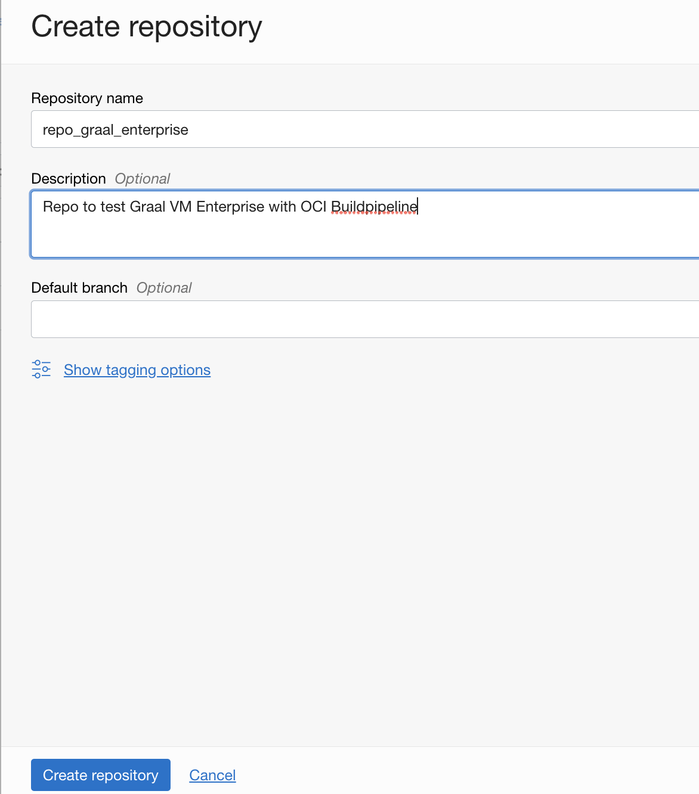

- Push the content to OCI Code repo - https://docs.oracle.com/en-us/iaas/Content/devops/using/clone_repo.htm

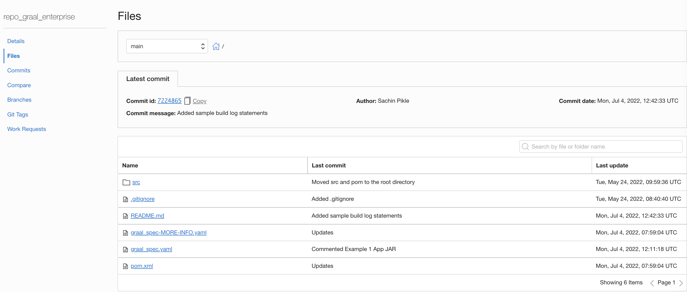

- You may use other supported version control repos as well (like Github.com, Bitbucket.com, Bitbucket Cloud, etc.). You may also need to adjust the policies according to the connection and setup external connections accordingly - https://docs.oracle.com/en-us/iaas/Content/devops/using/create_connection.htm

- Create a new build pipeline. - https://docs.oracle.com/en-us/iaas/Content/devops/using/create_buildpipeline.htm

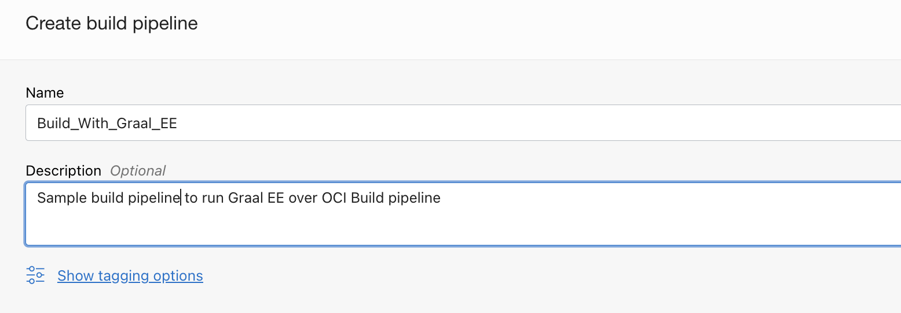

- Use the `Add Stage` option and add a `Managed Build` stage to the build pipeline - https://docs.oracle.com/en-us/iaas/Content/devops/using/add_buildstage.htm

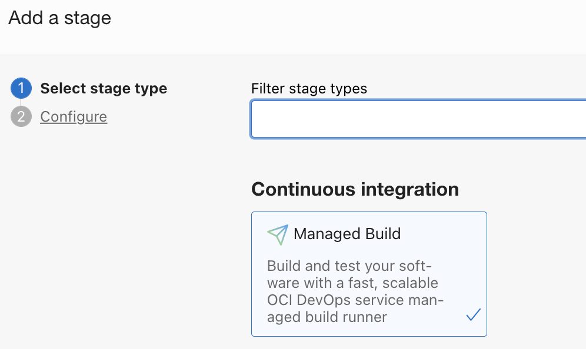

- Click `Next` and provide the details.

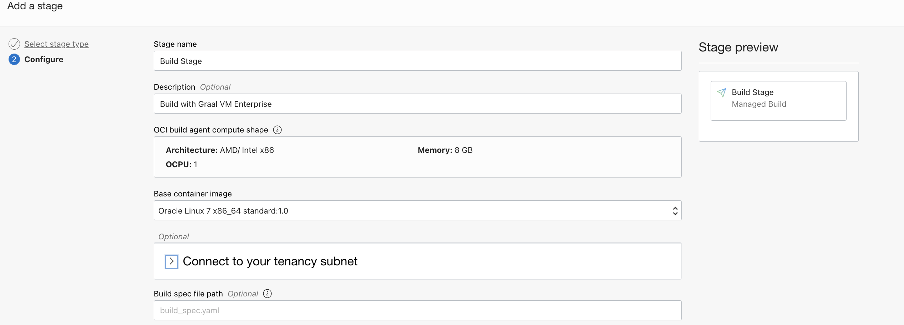

- Associate the Primary code repository with the code repo containing the actual code.

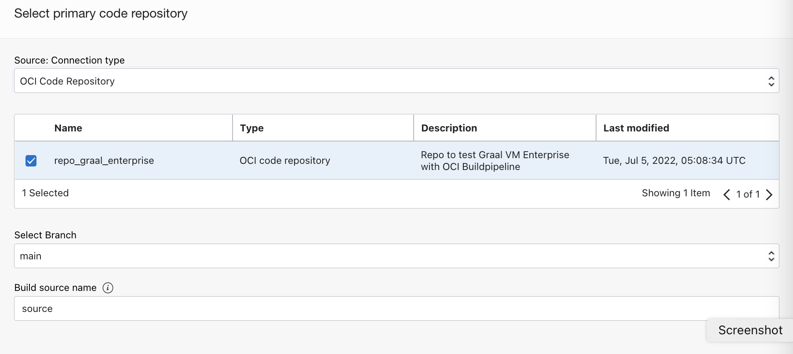

- Click `Add` and add the stage.


## Take a closer look at the build instructions below

To install and use GraalVM Enterprise in the DevOps build pipeline, the build specification file is as follows:

1. Add the following command to install one or more required GraalVM Enterprise components. For example, this command installs Native Image along with the Java Development Kit (JDK) and other necessary dependencies.

    ```shell
    steps:
      - type: Command
        name: "Install GraalVM Enterprise 22.x Native Image for Java17"
        command: |
          yum -y install graalvm22-ee-17-native-image
    ```

2. Set the JAVA_HOME environment variable.

    ```shell
    env:
      variables:
        "JAVA_HOME" : "/usr/lib64/graalvm/graalvm22-ee-java17"
    ```

3. Set the PATH environment variable.

    ```shell
    env:
      variables:
        # PATH is a reserved variable and cannot be defined as a variable.
        # PATH can be changed in a build step and the change is visible in subsequent steps.
    
    steps:
      - type: Command
        name: "Set PATH Variable"
        command: |
          export PATH=$JAVA_HOME/bin:$PATH
    ```

4. Build a native executable for your Java application.

    ```shell
    steps:
      - type: Command
        name: "Build a native executable"
        command: |
          mvn --no-transfer-progress -Pnative -DskipTests package
    ```

5. The executable file can be found under `target/my-app`.

```markdown
  - name: app_native_executable
    type: BINARY
    location: target/my-app
```

Here's the complete [build specification](build_spec.yaml) file.


## How to export the executable file outside of the build pipeline stage.

The following instructions will help you to export the `executable app file` to OCI Artifactory and which can then be used in the further stage including deployment pipelines.

- Create an OCI artifact registry. https://docs.oracle.com/en-us/iaas/Content/artifacts/home.htm


- Switch back to `DevOps Project` and create an `Artifact`- https://docs.oracle.com/en-us/iaas/Content/devops/using/artifacts.htm

- Select the type as `General artifact`


- Select the `Artifact source` as the Artifact Registry repository. Use `Select` and associate with the artifact registry created.

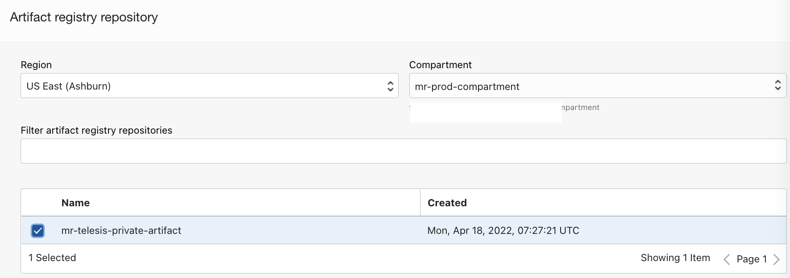


- Use option `Set Custom Location` as Artifact location.
- Provide a path and version as `${BUILDRUN_HASH}`, this is to maintain immutable artifacts.
- The variable `BUILDRUN_HASH` is derived during managed build stage and exported as an exportedVariables.You may use any other name ,but ensure to update the file [build_spec.yaml](build_spec.yaml).
- Select `Yes, substitute placeholders` as an option and click `Add`.

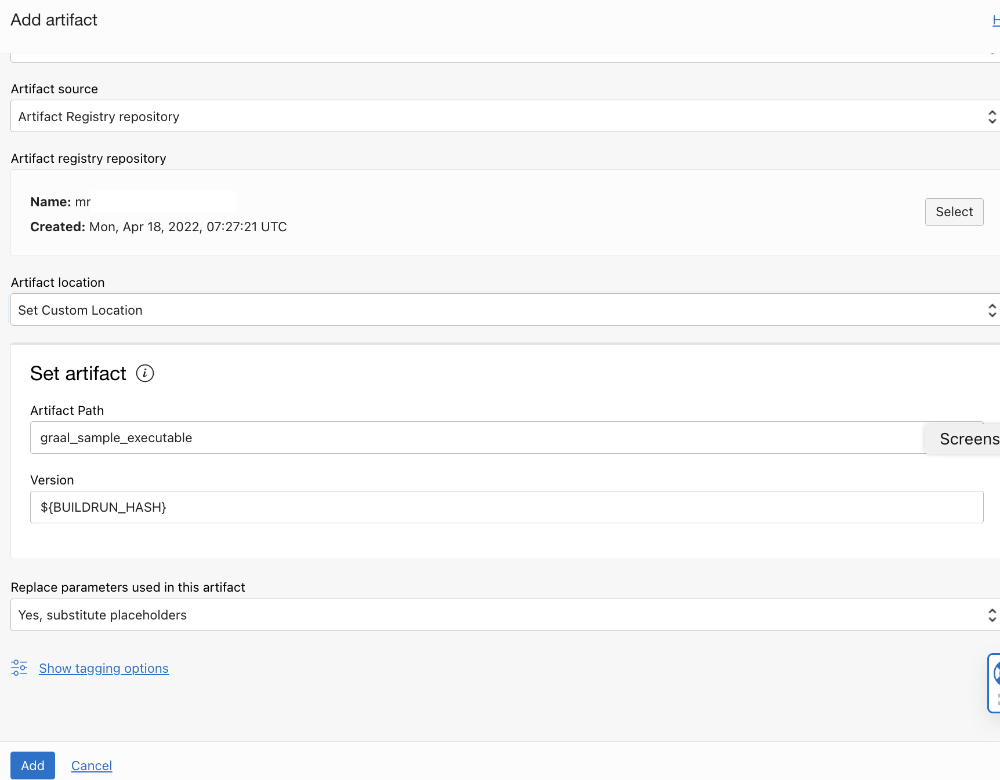

- Under `Build pipeline` use the `+` icon after the current stage and add a new stage named `Deliver artifacts`


- Associate it with the `DevOps Artifact` created.


- Use `app_native_executable` result artifact name.
- The name `app_native_executable` is a reference to the outputArtifact defined under the the file [build_spec.yaml](build_spec.yaml).
- Click `Add` and add the stage.

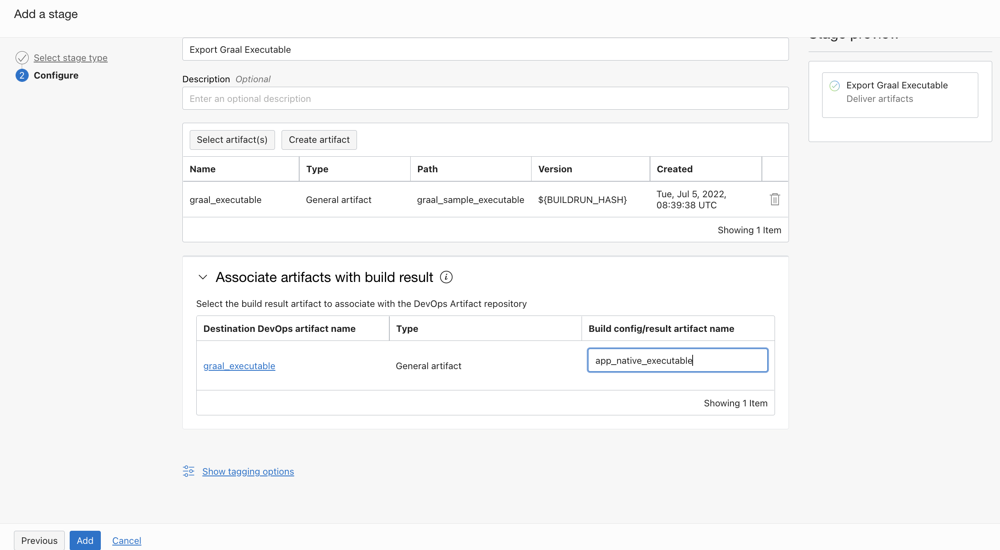


- The build pipeline with two stages would look like the one below.


## Let's test.

- Use `Start manual run` under OCI Buildpipeline and run the pipeline stages.


- Wait for all the stages to complete
  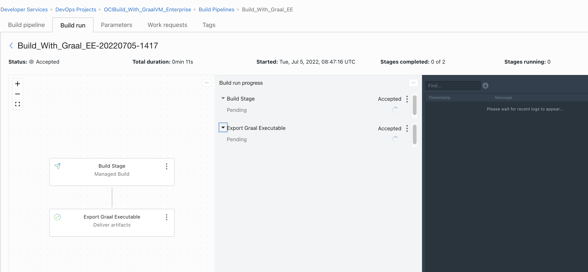

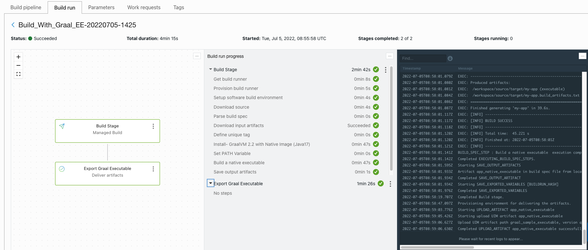

- You should see a new artfact under the `Artifact registry repo` created earlier.


- The exported executable can be used on any of the supporting infrastructures to execute or can use to deploy via `OCI deployment pipeline` to compute, container or function resources.

## Optional - Run build with more verbose output.

- An additional build instruction file as [build_spec_verbose.yaml](build_spec_verbose.yaml)
  can be used for more verbose output with the managed build.
- To do so, switch to `OCI DevOps project` > `OCI Build pipeline ` > Click `3 dots` on the `Managed Build` stage and click on `View details` and then `Edit Stage`.

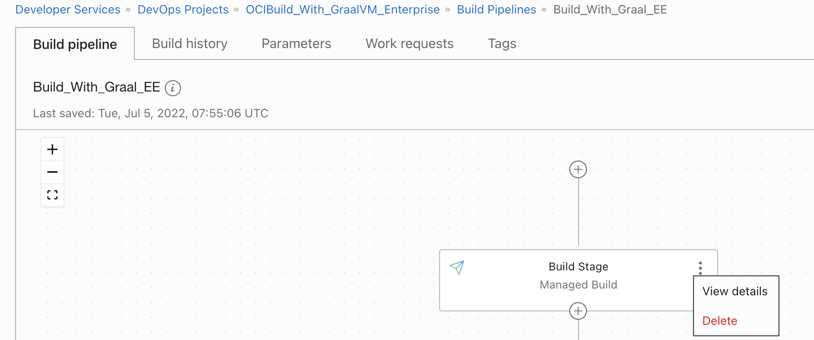

- Change  `Build spec file path` as `build_spec_verbose.yaml`  and `Save changes`

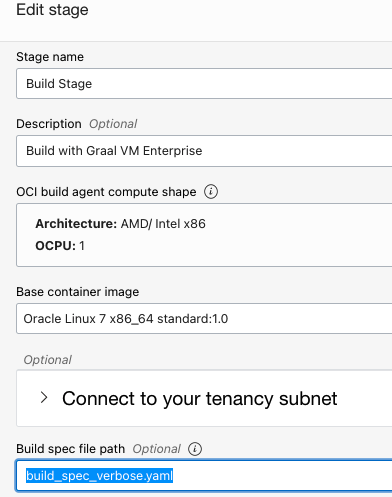

- Do another manual run for the build pipeline and you will see more verbose build logs.

## Sample Build Logs

1. The `yum install` build log statements should be similar to:

    ```shell
    ...
    EXEC: Installed:   
    EXEC:   graalvm22-ee-17-native-image.x86_64 0:22.1.0.1-1.el7                             
    EXEC:    
    EXEC: Dependency Installed:   
    EXEC:   glibc-static.x86_64 0:2.17-326.0.1.el7_9                                         
    EXEC:   graalvm22-ee-17-jdk.x86_64 0:22.1.0.1-1.el7                                      
    EXEC:   libstdc++-static.x86_64 0:4.8.5-44.0.3.el7                                       
    EXEC:   zlib-static.x86_64 0:1.2.7-20.el7_9                                              
    EXEC:    
    EXEC: Complete!
    ...
    ```

2. The native executable build log statements should be similar to:

    ```shell
    ...
    EXEC: ==================================================================
    EXEC: GraalVM Native Image: Generating 'my-app' (executable)...   
    EXEC: ==================================================================
    EXEC: [1/7] Initializing...                     (5.6s @ 0.11GB)   
    EXEC:  Version info: 'GraalVM 22.1.0.1 Java 17 EE'   
    EXEC:  C compiler: gcc (redhat, x86_64, 4.8.5)   
    EXEC:  Garbage collector: Serial GC   
    EXEC: [2/7] Performing analysis...  [******]    (9.5s @ 0.32GB)   
    EXEC:    1,880 (62.46%) of  3,010 classes reachable   
    EXEC:    1,684 (46.71%) of  3,605 fields reachable   
    EXEC:    7,784 (36.98%) of 21,049 methods reachable   
    EXEC:       21 classes,     0 fields, and   285 methods registered for reflection   
    EXEC:       48 classes,    32 fields, and    47 methods registered for JNI access   
    EXEC: [3/7] Building universe...                (1.1s @ 0.45GB)   
    EXEC: [4/7] Parsing methods...      [*]         (0.8s @ 0.58GB)   
    EXEC: [5/7] Inlining methods...     [****]      (1.2s @ 0.97GB)   
    EXEC: [6/7] Compiling methods...    [*****]     (21.2s @ 0.75GB)   
    EXEC: [7/7] Creating image...                   (0.9s @ 0.92GB)   
    EXEC:    2.62MB (46.31%) for code area:    3,708 compilation units   
    EXEC:    2.45MB (43.34%) for image heap:     945 classes and 38,518 objects   
    EXEC:  600.06KB (10.35%) for other data   
    EXEC:    5.66MB in total   
    EXEC: ------------------------------------------------------------------
    ...
    EXEC: ------------------------------------------------------------------
    EXEC: 0.9s (2.1% of total time) in 18 GCs | Peak RSS: 2.44GB | CPU load: 3.41   
    EXEC: ------------------------------------------------------------------
    EXEC: Produced artifacts:   
    EXEC:  /workspace/gvmee-yum/target/my-app (executable)   
    EXEC:  /workspace/gvmee-yum/target/my-app.build_artifacts.txt   
    EXEC: ==================================================================
    EXEC: Finished generating 'my-app' in 41.7s.   
    ...
    ```

References
==========

- Using GraalVM Enterprise in DevOps Build Pipelines - https://docs.oracle.com/en-us/iaas/Content/devops/using/graalvm.htm
- Oracle Cloud Infrastructure DevOps - https://docs.oracle.com/en-us/iaas/Content/devops/using/home.htm
- Oracle Graal VM Enterprise - https://www.oracle.com/java/graalvm/

Contributors
===========

- Author: [Rahul M R](https://github.com/RahulMR42).
- Collaborators: [Sachin Pikle](https://github.com/sachin-pikle)
- Last release: July 2022

### Back to examples.
----

- 🍿 [Back to OCI DevOps Build sample](./../README.md)
- 🏝️ [Back to OCI Devops sample](./../../README.md)


Regards,
M R
 

