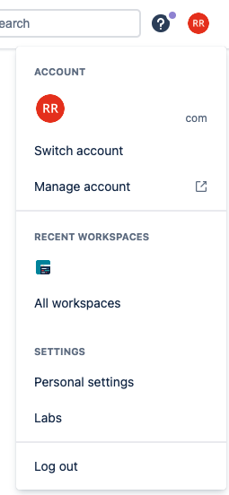
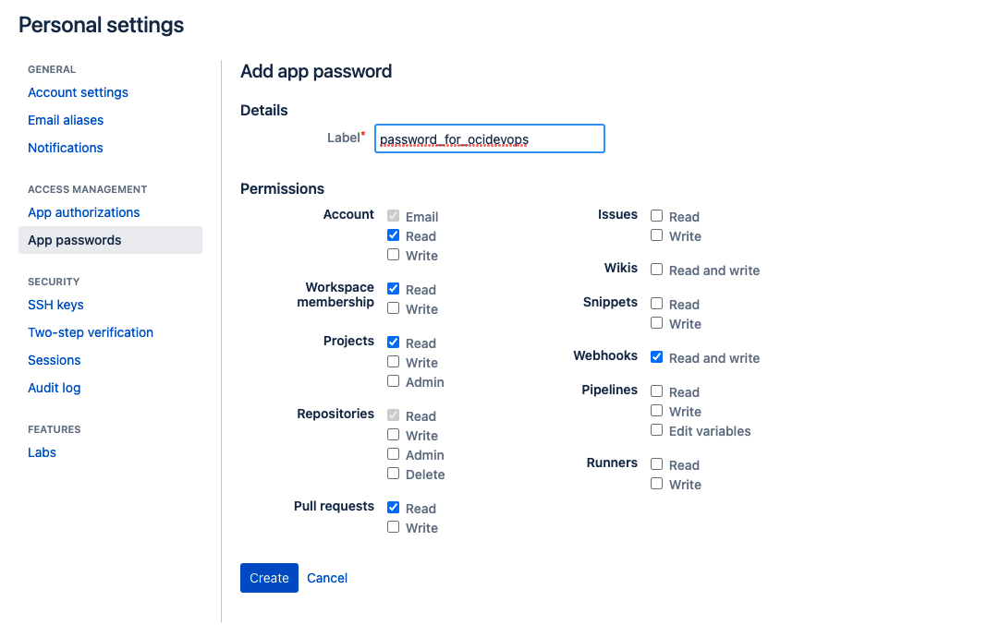
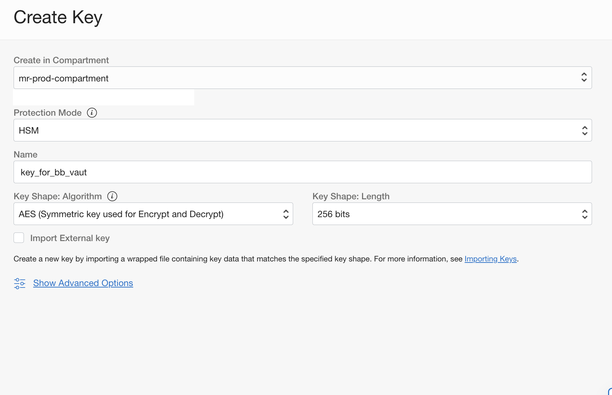
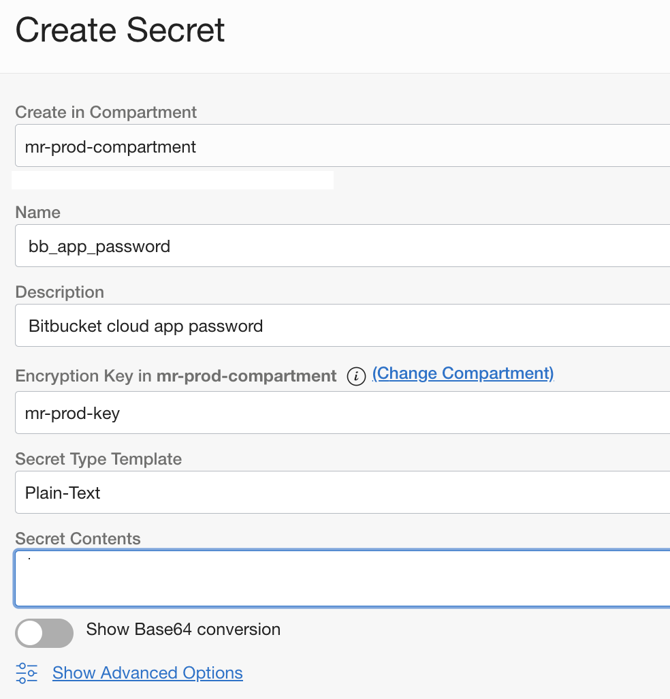
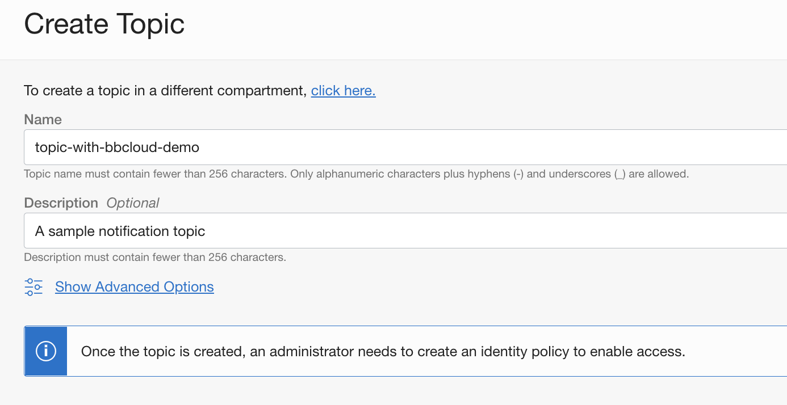
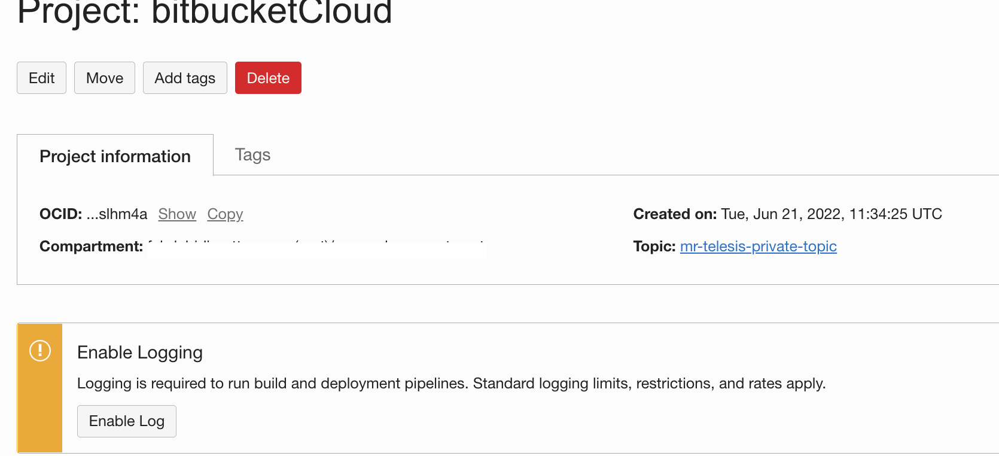
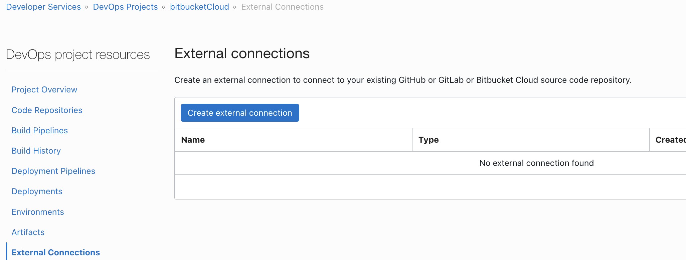
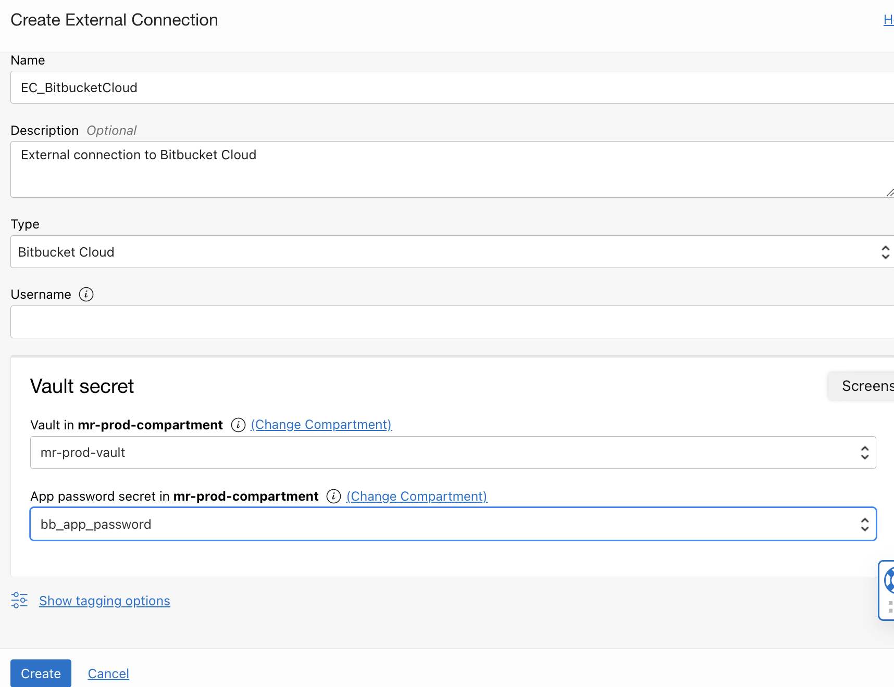
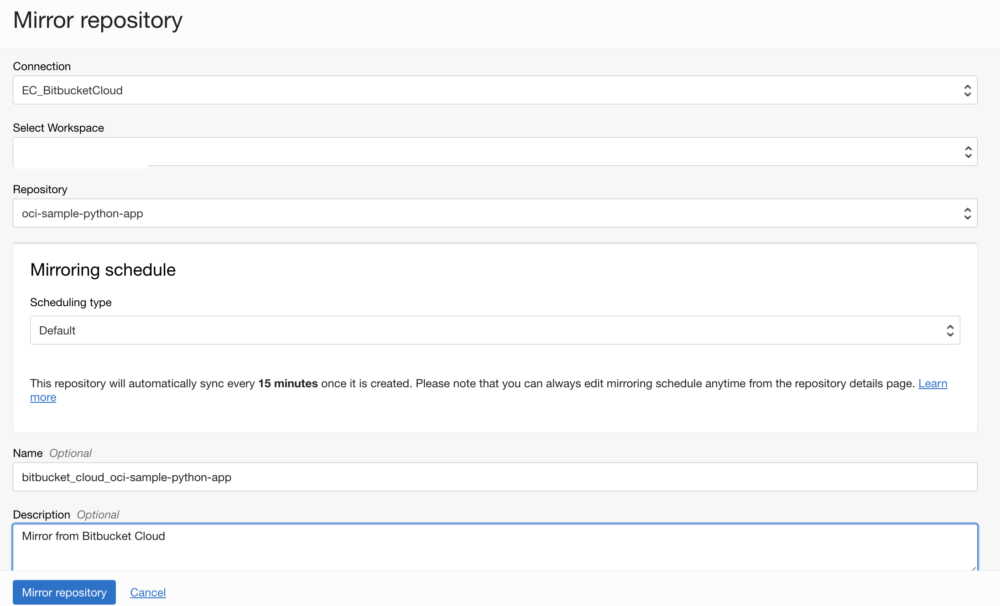

A sample illustration of [Bitbucket Cloud ](https://bitbucket.org/product?&aceid=&adposition=&adgroup=92542404895&campaign=1407242867&creative=544605032325&device=c&keyword=bitbucket%20cloud&matchtype=e&network=g&placement=&ds_kids=p51241240716&ds_e=GOOGLE&ds_eid=700000001551985&ds_e1=GOOGLE&gclid=EAIaIQobChMIsa_OyLy--AIV8pJmAh079go-EAAYASAAEgLsifD_BwE&gclsrc=aw.ds) code repo integration with OCI Devops.

--------

#### Objectives

- Create an APP Password on Bitbucket Cloud .
- Create vault ,policies as accordingly.
- Create a devops connection and integrate with OCI.
- Test and validate the integrations.

* Specific instruction to clone only this example.

    ```
    $ git init oci-devops-coderepo-with-bitbucketcloud
    $ cd oci-devops-coderepo-with-bitbucketcloud
    $ git remote add origin https://github.com/oracle-devrel/oci-devops-examples
    $ git config core.sparsecheckout true
    $ echo "oci-coderepo-examples/oci-devops-coderepo-with-bitbucketcloud/*">>.git/info/sparse-checkout
    $ git pull --depth=1 origin main

    ```

#### Procedure 

- Follow Bitbucket Cloud  documentation and do a sign in. - https://bitbucket.org/product/guides 
- Click `profile` on the top right corner and click `Personal Setting`.



- User `Personal Setting` > make a note of your `user name`.


- In the `left-side menu`, click `App passwords` and then click Create app password.
- Enter a `Label (name)` for the password.
- Select the following check boxes for Permissions:
  - Account: Read
  - Workspace membership: Read
  - Projects: Read
  - Pull requests: Read
  - Webhooks: Read and write


- Click Create.
- Copy the app password immediately to a secure location, because you cannot retrieve it again after you navigate away from the page.

- In order to securely store and orchestrate Gitlab Personal Access token , we will create a new OCI Vault for now .

- Create a new vault under the concerned compartment. - https://docs.oracle.com/en-us/iaas/Content/KeyManagement/Concepts/keyoverview.htm#Overview_of_Vault 


- Create a new `Encryption Key`.



- Create a new secrets and store the Bitbucket Cloud App password.



- Create a `Dynamic group` with below rules .

```
ALL {resource.type = 'devopsconnection', resource.compartment.id = 'ocid1.compartment.oc1..xxxxx'}
```

- Create a policy (Ensure to create it under the ROOT of tenancy) for the dynamic groups with below policy statement.

```
Allow dynamic-group mr-devops-policy-checker-dg-connection to read secret-family in compartment <compartment name>
Allow dynamic-group mr-devops-policy-checker-dg-connection to use ons-topics in compartment <compartment name>
```

- Create a notification topic ,that will be used for devops - https://docs.oracle.com/en-us/iaas/Content/Notification/Tasks/managingtopicsandsubscriptions.htm#createTopic




- Create a devops project - https://docs.oracle.com/en-us/iaas/Content/devops/using/create_project.htm#create_a_project
- Ensure to associate it with a `notification topic` created.


- Under the project click `Enable Logging` and `toggle`  and enable the logs.



- Select the logging details and enable .

- Create a new  `external connection` - https://docs.oracle.com/en-us/iaas/Content/devops/using/create_connection.htm



 - Select the type as `Bitbucket Cloud`.
 - Provide the `Bitbucket username ` as username.
 - Assocaite with the Vault and the `Secret` created 



- Use devops `Code Repositories` and mirror Bitbucket Cloud  to oci devops. - https://docs.oracle.com/en-us/iaas/Content/devops/using/mirror_repo.htm 


- Select the external connection created and select the Bitbucket Cloud  repository. You may mention a custom name (as optional) which will be used when the external repo is cloned to OCI Code repo.
- You may alter the Scheduling type to a custom value if needed .The default sync is `15 minutes`.



- After a while the repo will be available via `OCI Code Repo`


Contributors
===========

- Author : Rahul M R.
- Collaborators : NA
- Last release : June 2022

### Back to examples.
----

- 🍿 [Back to OCI Devops Coderepo sample](./../README.md)
- 🏝️ [Back to OCI Devops sample](./../../README.md)