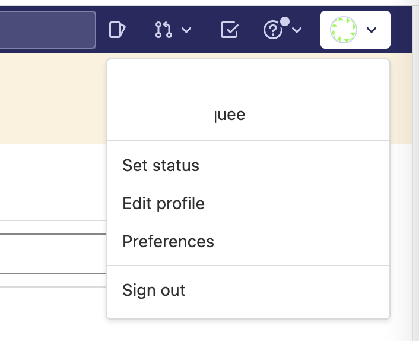
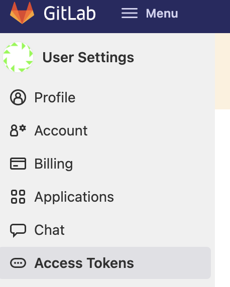
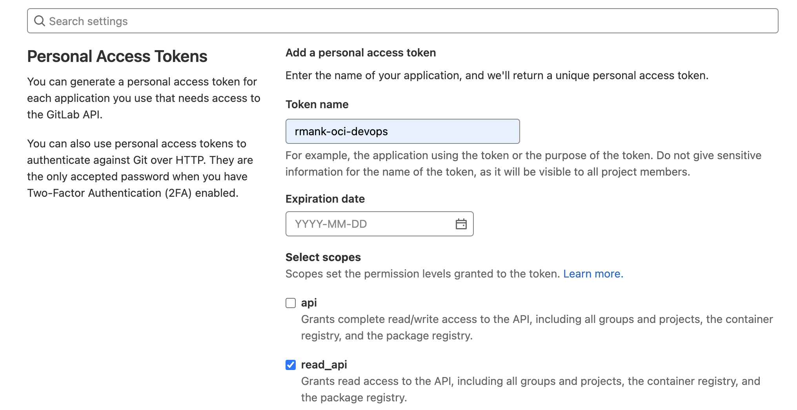
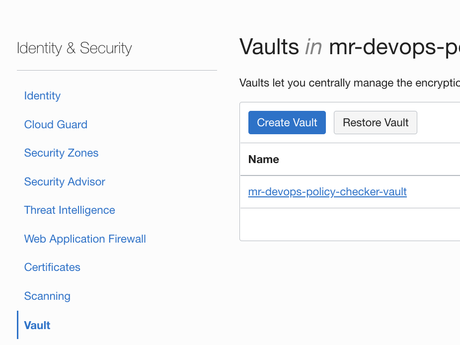
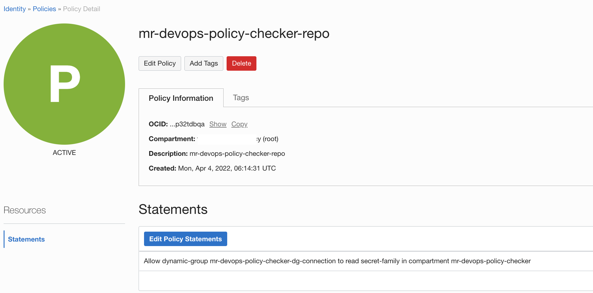
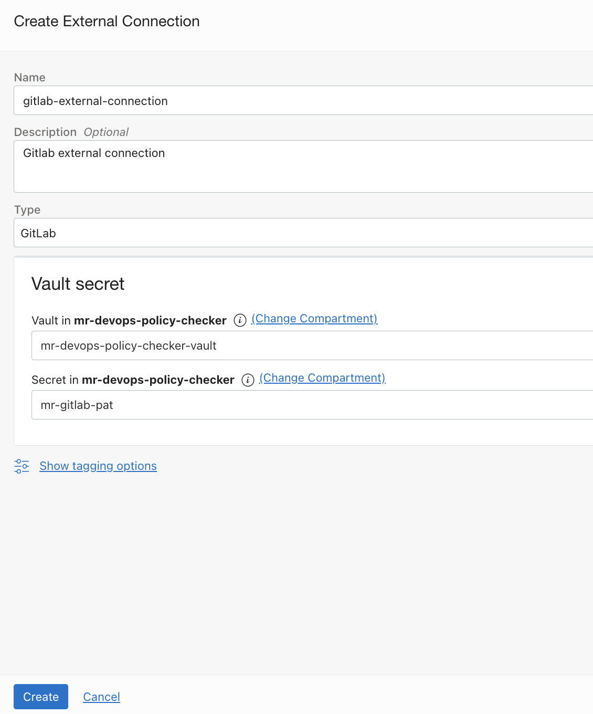
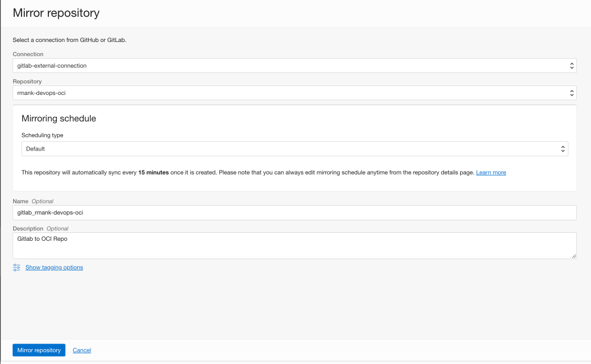

A sample illustration of [Gitlab](https://gitlab.com/) code repo integration with OCI Devops.

--------

#### Objectives

- Create a sample project and personal access token with Gitlab.
- Create vault ,policies as accordingly.
- Create a devops connection and integrate with OCI.
- Test and validate the integrations.

* Specific instruction to clone only this example.

    ```
    $ git init oci-devops-coderepo-with-gitlab
    $ cd oci-devops-coderepo-with-gitlab
    $ git remote add origin https://github.com/oracle-devrel/oci-devops-examples
    $ git config core.sparsecheckout true
    $ echo "oci-coderepo-examples/oci-devops-coderepo-with-gitlab/*">>.git/info/sparse-checkout
    $ git pull --depth=1 origin main

    ```

#### Procedure 

- Follow Gitlab documentation and do a sign in. - https://gitlab.com/users/sign_in 
- Create a Gitlab project - https://docs.gitlab.com/ee/user/project/working_with_projects.html 


- Click on the Gitlab profile icon  and select `Edit profile` option.



- Click `Access Tokens`



- Provide a token name and an Expiration date (optional).

- Select a scope `read_api`.



- Click `Create personal access token` and make a note of the token.


- In order to security store and orchestrate Gitlab Personal Access token , we will create a new OCI Vault now .

-  Create a new vault under the concerned compartment. - https://docs.oracle.com/en-us/iaas/Content/KeyManagement/Concepts/keyoverview.htm#Overview_of_Vault 




- Create a new `Encryption Key`.


- Create a new secrets and store the Gitlab - PAT.


- Create a `Dynamic group` with below rules .

```
ALL {resource.type = 'devopsconnection', resource.compartment.id = 'COMPARMENT OCID'}
ALL {resource.type = 'devopsrepository', resource.compartment.id = 'COMPARMENT OCID'}
```


- Create a policy (Ensure to create it under the ROOT of tenancy) for the dynamic groups with below policy statement.

```
Allow dynamic-group mr-devops-policy-checker-dg-connection to read secret-family in compartment <compartment name>

```



- Create a notification topic ,that will be used for devops - https://docs.oracle.com/en-us/iaas/Content/Notification/Tasks/managingtopicsandsubscriptions.htm#createTopic


- Create a devops project - https://docs.oracle.com/en-us/iaas/Content/devops/using/create_project.htm#create_a_project

- Ensure to associate it with a `notification topic`.


- Under the project click `Enable Logging` and `toggle`  and enable the logs.


- Select the logging details and enable .


- Create a new  `external connection` - https://docs.oracle.com/en-us/iaas/Content/devops/using/create_connection.htm


 - Select the type as `GitLab`  and associate with the Vault and secret created.

 

- Use devops `Code Repositories` and mirror external repo to oci devops. - https://docs.oracle.com/en-us/iaas/Content/devops/using/mirror_repo.htm 


- Select the external connection created and select the Gitlab repository. You may mention a custom name (as optional) which will be used when the external repo is cloned to OCI Code repo.

- You may alter the Scheduling type to a custom value if needed .The default sync is `15 minutes`.



- After a while the repo will be available via `OCI Code Repo`


Contributors 
===========

- Author : Rahul M R.
- Collaborators : NA
- Last release : Apr 2022

### Back to examples.
----

- 🍿 [Back to OCI Devops Coderepo sample](./../README.md)
- 🏝️ [Back to OCI Devops sample](./../../README.md)

