# Sample illustration of invoking a OCI Devops Deployment pipeline with [OCI Gitbub action](https://blogs.oracle.com/cloud-infrastructure/post/github-actions-with-oci).

------------

Objective
---

- Define new github actions with OCI to upload a container image and invoke a deploy.
- Execute the gihub action work flow and validate the deployment.


Specific instructions to download only this sample.
---

```
    $ git init oci-devops-githubactions-deploy
    $ cd oci-devops-githubactions-deploy
    $ git remote add origin https://github.com/oracle-devrel/oci-devops-examples
    $ git config core.sparsecheckout true
    $ echo "oci-deployment-examples/oci-devops-githubactions-deploy/*">>.git/info/sparse-checkout
    $ git pull --depth=1 origin main

```

## Prerequisites 

- Access to a OCI Tenancy (Free tier or Paid ).
- Access to Github.com or a Github instance where we can run OCI Github actions.

Procedure
---
- Create or Fetch below values and make a note , we will be using them behind Github secrets.
- Refer here for more - https://docs.oracle.com/en-us/iaas/Content/Identity/Tasks/managingcredentials.htm#create_swift_password 
- 
```markdown
OCI_AUTH_TOKEN = User access token.
OCI_CLI_FINGERPRINT = User fingerprint.
OCI_CLI_KEY_CONTENT = User ssh public key.
OCI_CLI_REGION = OCI Region.
OCI_CLI_TENANCY = OCID of tenancy
OCI_CLI_USER = OCID of the user.
OCI_COMPARTMENT_OCID = OCID of the compartment

```

- Create a dynamic group and add below rules.

```markdown
ALL {resource.type = 'devopsdeploypipeline', resource.compartment.id = 'OCID of the Compartment'}
```

- Create a policy on to the dynamic group.

```markdown
Allow dynamic-group <NAME of the DYNAMIC GROUP> to manage  cluster-family in compartment <COMPARTMENT NAME>
Allow dynamic-group <NAME of the DYNAMIC GROUP> to manage  ons-topics in compartment <COMPARTMENT NAME>
Allow dynamic-group <NAME of the DYNAMIC GROUP> to manage  repos in compartment <COMPARTMENT NAME>
```

- Create an OCI notification topic. - https://docs.oracle.com/en-us/iaas/Content/Notification/Tasks/managingtopicsandsubscriptions.htm#createTopic
- Create an OCI Oracle Container engine for Kubernetes (OKE) - https://docs.oracle.com/en-us/iaas/Content/ContEng/Tasks/contengcreatingclusterusingoke_topic-Using_the_Console_to_create_a_Quick_Cluster_with_Default_Settings.htm#create-quick-cluster 

- Create an OCI devops project - https://docs.oracle.com/en-us/iaas/Content/devops/using/create_project.htm#create_a_project 


- Ensure to enable the `logs` for the devops project. 

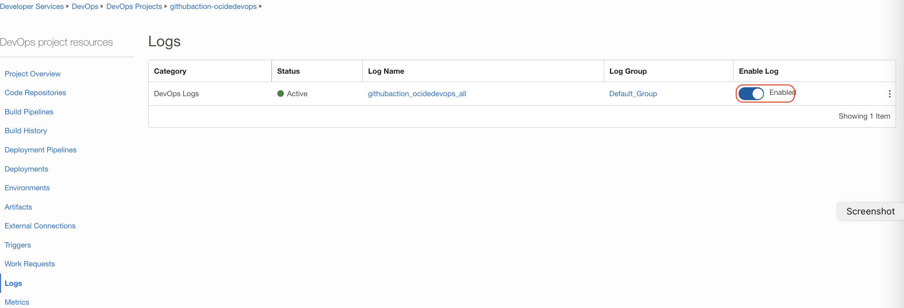

- Create a new devops environment of type `Kubernetes Cluster` and associate with the OKE cluster created- https://docs.oracle.com/en-us/iaas/Content/devops/using/create_oke_environment.htm 

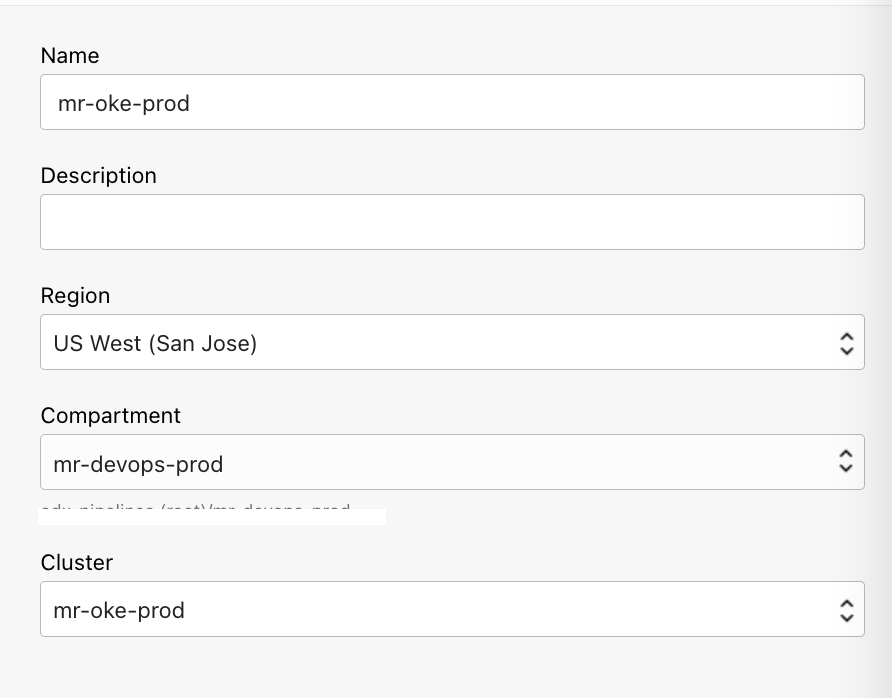

- Create a devops artifact of type `Kubernetes manifest` - https://docs.oracle.com/en-us/iaas/Content/devops/using/artifacts.htm


- Select `Inline` as Artifact source.


- Copy the content of file [deploymentmanifest.yaml](deploymentmanifest.yaml) as value.


- With in the content , update the value of image with proper values against the place holder 
```markdown
image: <OCI Region>.ocir.io/<Namespace>/python_fastapi_app:${image_tag}
EG : us-sanjose-1.ocir.io/MyNameSpace/python_fastapi_app:${image_tag}
```
- Ensure that the option `Allow parameterization` is checked in.


- Create a new deployment pipeline - https://docs.oracle.com/en-us/iaas/Content/devops/using/deployment_pipelines.htm 


- Use `+` and add  new stage as `Deploy OKE`

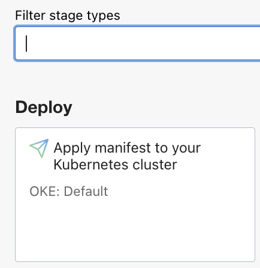

- Provide a stage name.


- Associate with the `devops artifact` and `devops environment` created with the stage.Create stage.

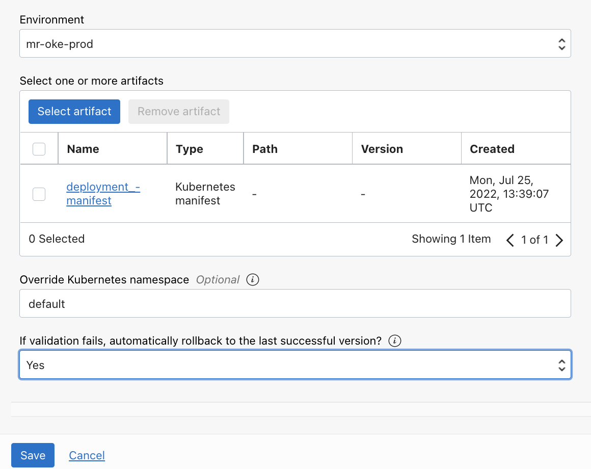

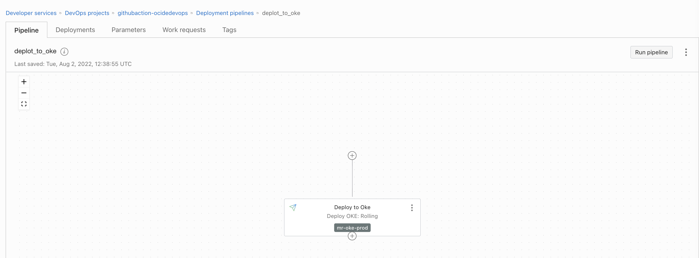

- Click on the `Paramters` and add below key and values.

```markdown
Name : image_tag / Default value : 0 
Name : namespace / Default vaule : ns-github
```
We can override this from Github actions while executing.


- Switch back to Devops project overview , click on `Deployment Pipelines` , click `copy` under OCID and make a note of  the OCID of the deployment pipeline.

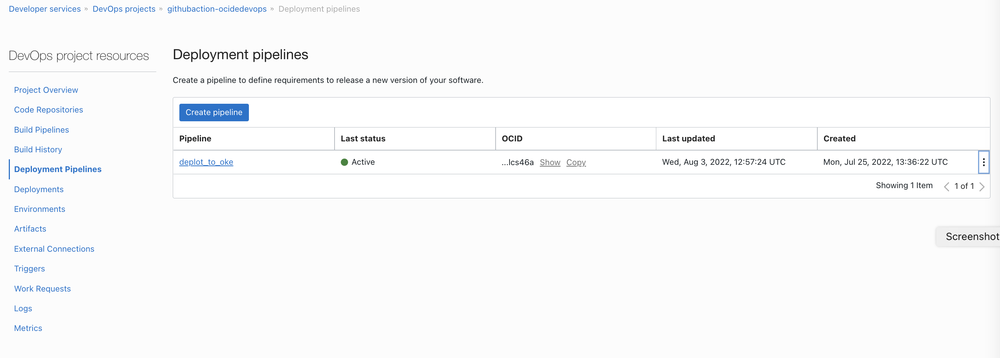

- Login to `https://github.com` or any other Github instances as you prefer.

- Click on `Profile icon` > `Settings`


- Click on `Developer settings`

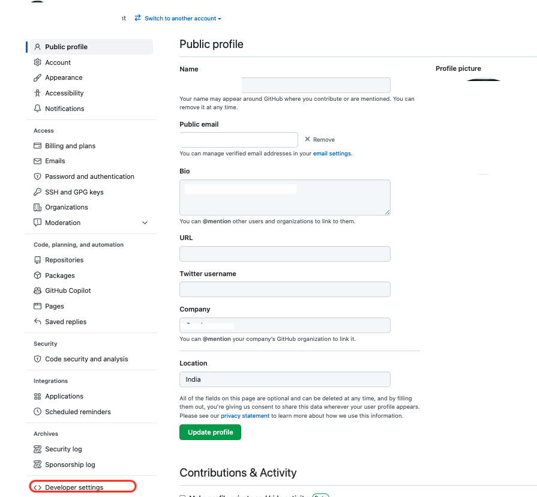

- Create a new `Personal access token`


- Ensure to select `Repo` and `Workflow` access as minimum . Use the expiration duration as accordingly.

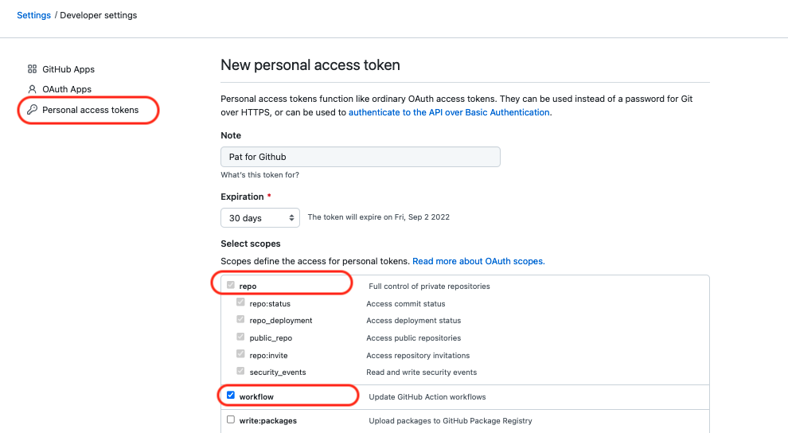

Make a note of the `PAT`

- Click `+` and create a new repository.

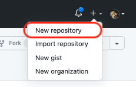


- Click `Settings`

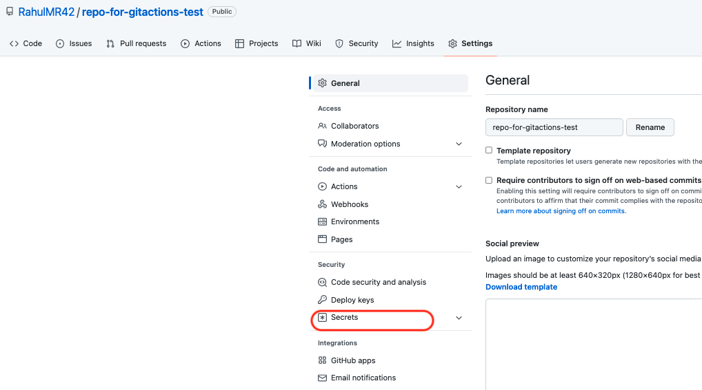

- Select `Secrets` > `Action`.

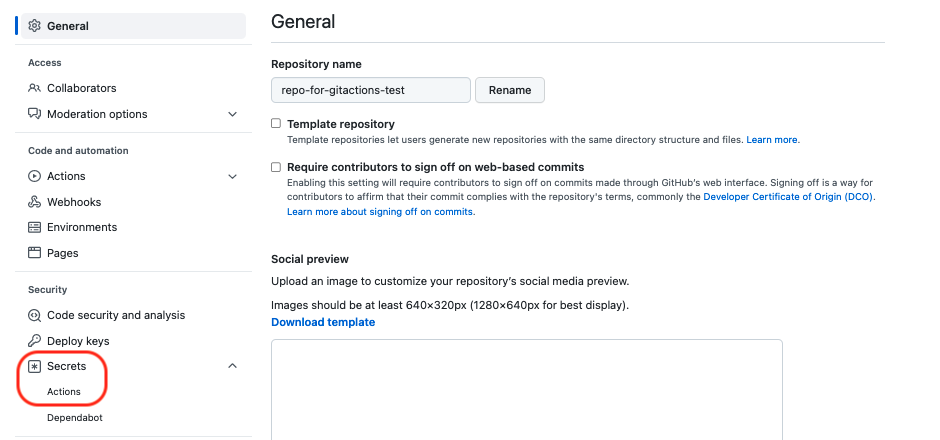


- Click `New repoistory secrets` and add below values.You do not need to use them with ""

```markdown
DEPLOYMENT_PIPELINE_OCID = OCID of deployment pipeline 
OCI_AUTH_TOKEN = User access token.
OCI_CLI_FINGERPRINT = User fingerprint.
OCI_CLI_KEY_CONTENT = User ssh public key.
OCI_CLI_REGION = OCI Region.
OCI_CLI_TENANCY = OCID of tenancy
OCI_CLI_USER = OCID of the user.
OCI_COMPARTMENT_OCID = OCID of the compartment

```
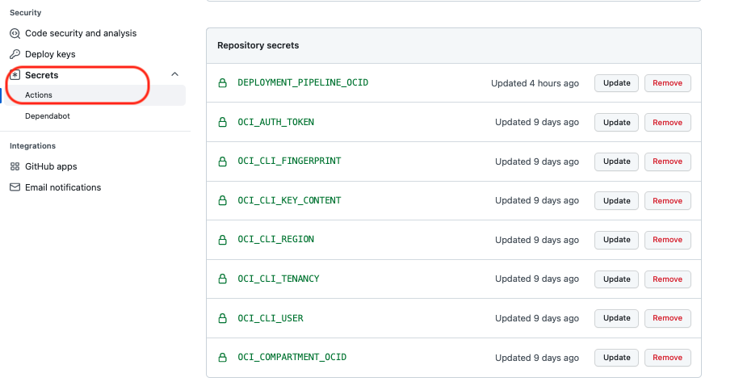

- The file [oci_actions.yaml](.github/workflows/oci_actions.yml) contains the defenition of Github actions.Let us do a close look .

```markdown
name: OCI Deploy
# Controls when the workflow will run
on:
  # Triggers the workflow on push or pull request events but only for the "dev" branch
  push:
    branches: [ "main"] <== The action will occur when there is a push event to branch main. You can add more branches or more events.

jobs:
  get-ocir-repository-test:
    runs-on: ubuntu-latest
    name: Invoke OCI Deployment on to OKE .
    env:  <== These are the settings for OCI Github actions
      OCI_CLI_USER: ${{ secrets.OCI_CLI_USER }}
      OCI_CLI_TENANCY: ${{ secrets.OCI_CLI_TENANCY }}
      OCI_CLI_FINGERPRINT: ${{ secrets.OCI_CLI_FINGERPRINT }}
      OCI_CLI_KEY_CONTENT: ${{ secrets.OCI_CLI_KEY_CONTENT }}
      OCI_CLI_REGION: ${{ secrets.OCI_CLI_REGION }}

    steps:
      - name: Get or create an OCIR Repository <== This will check for a container registry repo/ or create a new one.
        uses: oracle-actions/get-ocir-repository@v1.0
        id: get-ocir-repository
        with:
          name: python_fastapi_app
          compartment: ${{ secrets.OCI_COMPARTMENT_OCID }}

      - name: Log into OCIR <== Login to the containe registry repo (even if its private) using access token 
        uses: oracle-actions/login-ocir@v1.0
        id: login-ocir
        with:
          auth_token: ${{ secrets.OCI_AUTH_TOKEN }}

      - name: Check out code
        uses: actions/checkout@v2

      - name: Tag and push a container image <== Create a container image.
        id: tag-and-push-image
        run: |
          ls -ltr
          docker build -t "${{ steps.get-ocir-repository.outputs.repo_path }}:${{github.run_number}}" .
          docker push "${{ steps.get-ocir-repository.outputs.repo_path }}:${{github.run_number}}"


      - name: Generate deploy arguments <== Creates a replacements for deployment paramters.Also add a dynamic container image tag.
        id: create-json
        run: |
          echo "::set-output name=metadata::{\"created_by\":\"$GITHUB_ACTOR\",\"triggered_by\":\"$GITHUB_EVENT_NAME\"}"
          echo "::set-output name=deployargs::{\"items\":[{\"name\":\"namespace\",\"value\":\"ns-github\"},{\"name\":\"image_tag\",\"value\":\"$GITHUB_RUN_NUMBER\"}]}"


      - name: Display and save the generated JSON
        run: |
          echo '${{ steps.create-json.outputs.metadata }}' | jq
          echo '${{ steps.create-json.outputs.deployargs }}'


      - name: Invoke deployment pipeline <== Invoke the deployment
        uses: oracle-actions/run-oci-cli-command@v1.0
        id:  invoke-deployments
        with:
          command: devops deployment create-pipeline-deployment --pipeline-id ${{ secrets.DEPLOYMENT_PIPELINE_OCID }} --deployment-arguments ${{ toJSON(steps.create-json.outputs.deployargs) }}
          silent: false
```


## Create a push and invoke the github actions.

- Add the content and push to the repository .

```markdown
$ git remote add origin <Github repo url>
git branch -M main
git push -u origin main
```
- Click on `Actions under the repo`


- View the workflow and you should see an action running.


- Click details and view the actions.

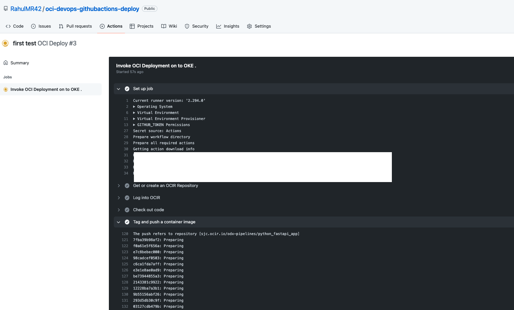

- Wait for the all the steps to complete.

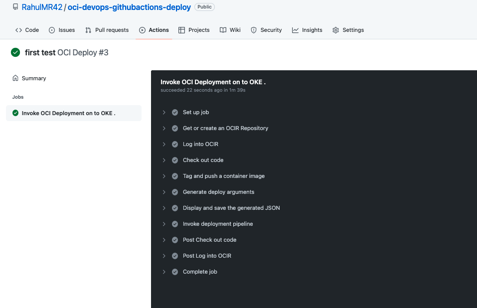

- Click on the steps and you can get more details

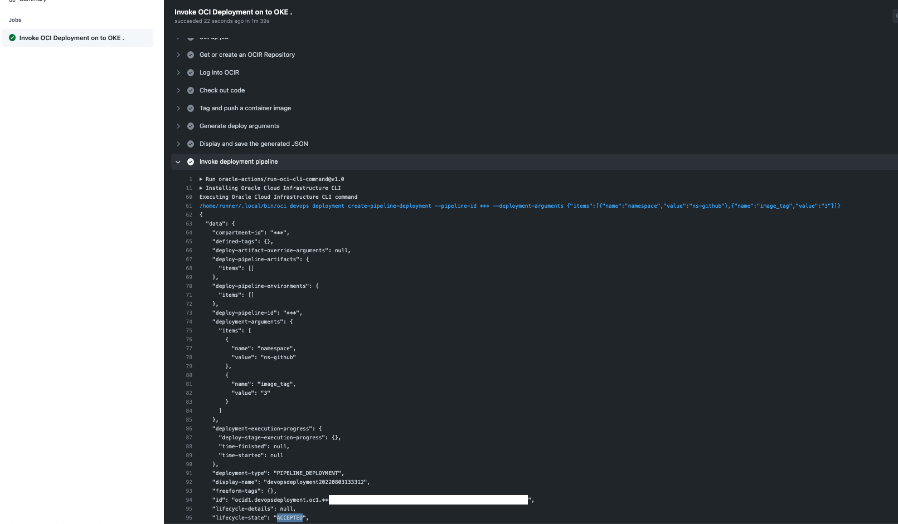

- You may encounter issues mostly if the secrets are wrong or missed the polices /dgs.
- You should see a new container image is pushed to the Container registry repo and a new deployments is in progress under the deployment pipeline.


- Connect to `OKE Cluster` , using OKE - `Access Cluster` steps.


- Once connected to OKE via cloud shell or local access. Run below and fetch the public IP and validate the application.

```markdown
kubectl get all -n ns-github
```

- Access the application via curl ```curl http://<EXTERNAL IP >``` or via browser.


Read more
----

- OCI Devops - https://docs.oracle.com/en-us/iaas/Content/devops/using/home.htm.
- OCI Reference architectures  -  https://docs.oracle.com/solutions/
- OCI Devops samples - https://github.com/oracle-devrel/oci-devops-examples


Contributors
===========

- Author : [Rahul M R](https://github.com/RahulMR42).
- Collaborators : NA
- Last release : July 2022


### Back to examples.
----

- 🍿 [Back to OCI Devops Deployment sample](./../README.md)
- 🏝️ [Back to OCI Devops sample](./../../README.md)


