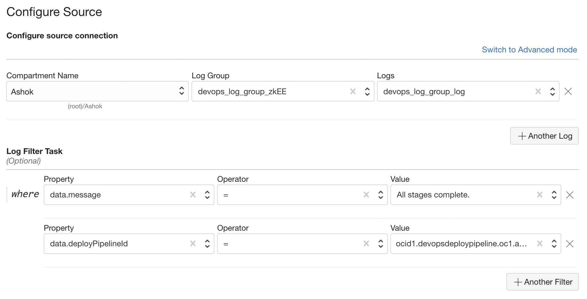

# OCI DevOps Cascaded Pipelines

## Trigger Build Pipeline from Build Pipeline

### Prerequisites
* One deploy pipeline
* Another deploy pipeline (triggered after the above deploy pipeline)

#### 1. Deploy Function
**Step 1:**
Clone the repository code.
```
$ git init oci-devops-coderepo-with-gitlab
$ cd oci-devops-coderepo-with-gitlab
$ git remote add origin https://github.com/oracle-devrel/oci-devops-examples
$ git config core.sparsecheckout true
$ echo "oci-pipeline-examples/oci-cascaded-pipelines/same-region/trigger-deploy-from-deploy/*">>.git/info/sparse-checkout
$ git pull --depth=1 origin main
```

**Step 2:**
Change to function directory.
```
$ cd node-function
```

**Step 3:**
In `func.yaml`, update `deploy_pipeline_id` and `display_name_prefix_for_new_run` with appropriate values as below.

```
config:
  deploy_pipeline_id: "<DEPLOY-PIPELINE-OCID>"
  display_name_prefix_for_new_run: "AutoTriggeredCascadedPipeline_"
```

**Step 4:**
Deploy the function with below command.
```
$ fn -v deploy --app <app-name>
```

#### 2. Configure Service Connector Hub
**Step 1:**

Open Menu > `Observability & Management` > `Service Connectors`

**Step 2:**

Set Service Connector Source as `Logging` and Target as `Functions`

**Step 3:**

Configure Source as below



* Choose Compartment, Log Group, Logs of your DevOps Project.
* set `data.deployPipelineId` to the previous pipeline OCID as above.
* set `data.message` to the last successful unique log message like `All stages complete.`

**Step 4:**

Configure Target with `Function Application` and `Function` as `trigger-deploy-pipeline-from-deploy-pipeline` as below


